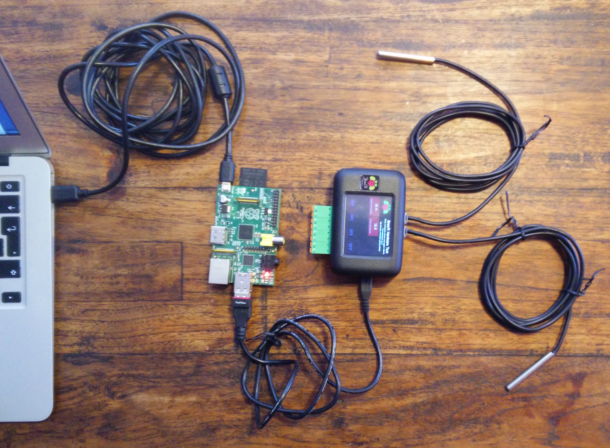

# BrewPi setup

These are my notes on getting started with a [BrewPi](http://www.brewpi.com/introducing-brewpi-spark/).

This is a 'headless' Raspberry Pi setup, no keyboard or monitor is plugged into the Raspberry Pi at any time, all interaction is done over the network via a separate computer.

## Useful links

This document is essentially a combination of information that's readily available from these pages:

- [BrewPi official software install guide](https://community.brewpi.com/t/software-install-guide/312)
- [BrewPi community forum](https://community.brewpi.com/)
- [BrewPi on GitHub](https://github.com/BrewPi)
- [Raspberry Pi docs](https://www.raspberrypi.org/documentation)

## Equipment

- Raspberry Pi
- Blank SD Card
- 2 micro USB cables
- BrewPi Spark
- Network cable
- Router connected to a network
- Computer / laptop of some kind (connected to the same network)

I wrote these steps based on the computer being a Mac running OSX. They may vary for a Linux or Windows computer. I used an old Raspberry Pi 1 Model B, any newer Raspberry Pi Model B or B+ should also work.

## Raspberry Pi software setup

I'll use the terms 'Raspberry Pi' and 'rpi' interchangeably for the rest of this document.

1. Copy the OS (Operating System) files onto the SD card via your computer. I used [Raspbian Jessie Lite](https://www.raspberrypi.org/downloads/raspbian/) and the instructions on the [rpi website](https://www.raspberrypi.org/documentation/installation/installing-images/README.md)

1. Plug the SD card into the rpi, along with a network cable (the other end should be attached to your router). Plug a powered micro USB cable into the rpi.

  Once the rpi has started up, you should be able to use your home router to work out the rpi's IP address. [See here for further instructions on finding your rpi's IP address](https://www.raspberrypi.org/documentation/troubleshooting/hardware/networking/ip-address.md).

  Remember this IP address, it'll be useful later.

1. Using terminal (or equivalent for Windows/Linux) login to the rpi with `ssh pi@x`, where `x` will be replaced with the IP address from the previous step. Something like `192.168.1.80`. The password is 'raspberry'.

1. After logging in to the rpi, update its software with this series of commands:

  ```
  sudo apt-get update
  sudo apt-get upgrade
  sudo apt-get install rpi-update
  sudo rpi-update
  ```

1. Install git with `sudo apt-get install git`

1. Reboot the rpi with `sudo reboot`, you'll be disconnected while it reboots. It'll take a minute or so to reboot, after it's finished you'll be able to login again. Login again.

1. Install the BrewPi software with `git clone https://github.com/BrewPi/brewpi-tools.git ~/brewpi-tools`

1. Run the brewpi install script: `sudo ~/brewpi-tools/install.sh`

1. If you want to setup wifi, do that now. [Instructions can be found on the rpi website](https://www.raspberrypi.org/documentation/configuration/wireless/wireless-cli.md)

## Connect the Raspberry Pi with the BrewPi

1. Connect the Raspberry Pi to the BrewPi like this:

  `Power --usb--> Raspberry Pi --usb--> BrewPi`

1. Connect your temperature sensors to the BrewPi

1. With everything hooked up you should have something that looks a bit like this:

  

  My rpi is using wifi, otherwise there would also be a network cable plugged into the rpi.

1. Open a web browser and go to `http://x`, where `x` is the IP address from earlier.  
